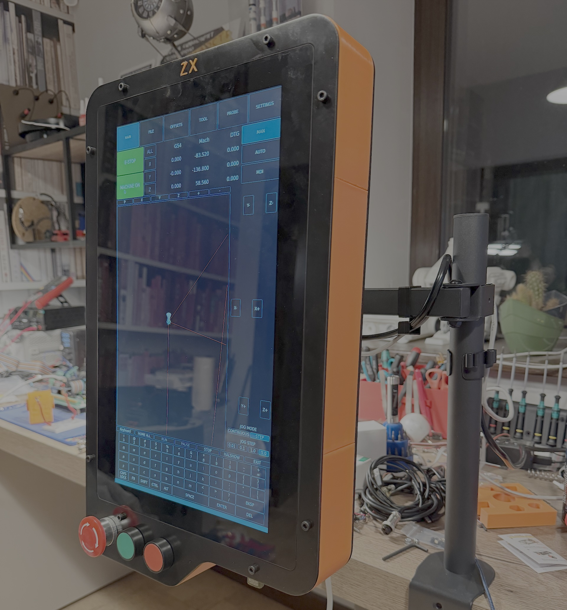

# LinuxCNC Control Panel

This is a hardware project to build a LinuxCNC control panel with a touchscreen based on Raspberry Pi 5

The project contains STEP file with full assembly of all the parts.

Separately you will find 2 DXF files for laser cutting front and rear plates of the panel from 3 mm aluminum sheet metal and STL files for printing enclosure frame of the panel.

For E-Stop, Run and Stop any standard 22 mm buttons can be used.

Power supply used in this panel is a dual channel MeanWell RD-50A with 5V and 12V output voltage.

Display with touchscreen is 15.6 inch 1920x1080 DWIN HDW156-001L.

Cable extensions for ethernet and USB as well as the power socket with switch can be easily found on AliExpress.

[A detailed assembly video on YouTube](https://youtu.be/6MMDeRKqlNU)
